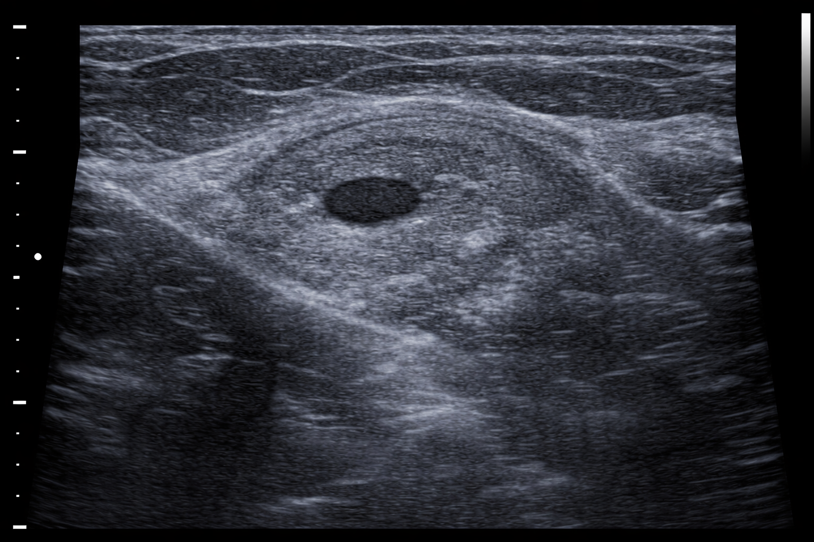
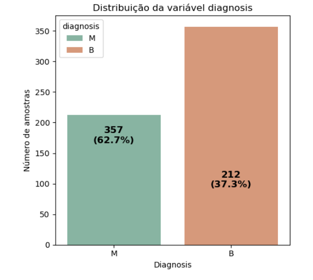
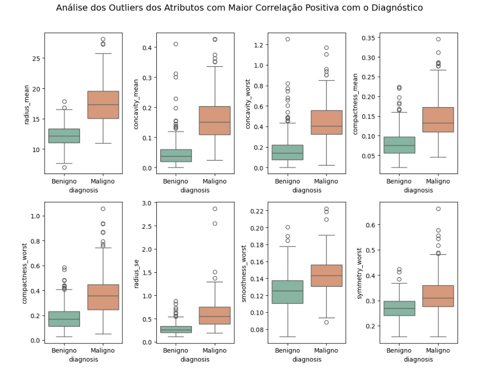
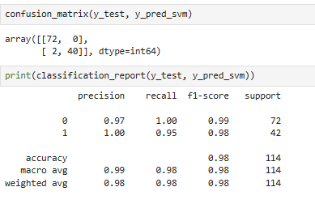
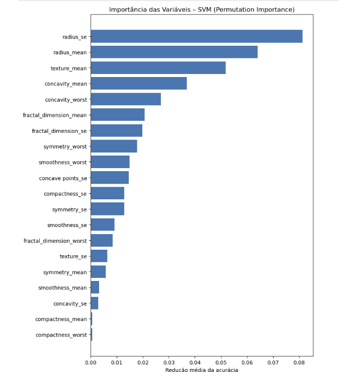

# Breast Cancer Diagnosis with Machine Learning

  

# Visão Geral

Este projeto aplica técnicas de Ciência de Dados e Machine Learning para auxiliar no diagnóstico de câncer de mama, classificando tumores como benignos ou malignos a partir de características extraídas de imagens de exames.

O foco principal é reduzir falsos negativos, uma vez que, em contextos médicos, classificar um tumor maligno como benigno representa um risco significativo à saúde do paciente.

# Objetivo do Projeto

Desenvolver e avaliar modelos de classificação supervisionada capazes de:
- Identificar tumores malignos com alta sensibilidade (recall)
- Minimizar falsos negativos
- Comparar diferentes algoritmos quanto a desempenho, generalização e complexidade
- Selecionar um modelo equilibrado para apoio à decisão clínica, não para diagnóstico definitivo

# Dataset

- Nome: Breast Cancer Wisconsin (Diagnostic)
- Fonte: UCI Machine Learning Repository

## Descrição:
O dataset contém medições numéricas derivadas de imagens digitalizadas de biópsias de mama, incluindo características como:

- Raio
- Textura
- Perímetro
- Área
- Suavidade, entre outras

## Variável alvo:
- Malignant (câncer)
- Benign (não câncer)

# Metodologia

O projeto foi desenvolvido seguindo as etapas abaixo:

## 1 - Análise Exploratória de Dados (EDA)

- Estatísticas descritivas                                   
- Distribuição da variável alvo
- Análise de correlação entre atributos                                     
- Relação entre variáveis e diagnóstico                                    
- Avaliação visual de outliers 
- Extração de insights clínicos e estatísticos relevantes                       

  

  

 

## 2 - Pré-processamento

- Separação em treino e teste
- Escalonamento de atributos (RobustScaler)
- Justificativa técnica para manutenção de outliers (informação clínica relevante)

## 3 - Modelagem

**Modelos avaliados:**

- Regressão Logística
- KNN
- SVM (RBF)
- Decision Tree
- Random Forest
- XGBoost
- LightGBM

## 4 - Avaliação

**Métricas consideradas:**

- Acurácia                       
- Recall para classe Maligna                         
- Número de falsos negativos
- Comparação entre treino e teste (generalização)
                            

  

        

| Modelo              | Acurácia (Teste) | Recall (Maligna) | Falsos Negativos |
| ------------------- | ---------------- | ---------------- | ---------------- |
| Regressão Logística | 97,37%           | 0,93             | 3                |
| KNN                 | 93,86%           | 0,86             | 6                |
| **SVM (RBF)**       | **98,25%**       | **0,95**         | **2**            |
| Decision Tree       | 92,11%           | 0,86             | 6                |
| Random Forest       | 94,74%           | 0,90             | 4                |
| XGBoost             | 96,49%           | 0,93             | 3                |
| LightGBM            | 97,37%           | 0,95             | 2                |

# Modelo Escolhido

## SVM com kernel RBF

**Justificativa:**

- Alta sensibilidade para tumores malignos
- Menor número de falsos negativos
- Excelente capacidade de generalização
- Boa estabilidade entre treino e teste                                      

  

                            

# Interpretação e Impacto no Mundo Real

Embora o modelo apresente alto desempenho, ele não substitui diagnóstico médico. Seu uso é indicado como:

- Ferramenta de apoio à decisão
- Auxílio na priorização de casos suspeitos
- Redução do risco de diagnósticos tardios

O conceito de **risco residual** é considerado: mesmo com métricas elevadas, erros ainda podem ocorrer, reforçando a necessidade de avaliação clínica humana.

# Visualizações

## O projeto inclui gráficos como:

- Distribuição das variáveis
- Mapas de correlação
- Matrizes de confusão
- Comparação entre modelos
- Análise de possíveis sinais de overfitting

**Nota:** Algumas imagens são ilustrativas e foram geradas por Inteligência Artificial, utilizadas exclusivamente para fins educacionais.

# Estrutura do Repositório

├── notebooks/                      
│   └── projeto_breast_cancer.ipynb                                
├── images/                    
│   └── ultrassonografia_mama_ia.png                       
├── README.md                    

# Como executar o Projeto

git clone https://github.com/claudiarpaim/Breast-Cancer-Wisconsin.git                                          
pip install -r requirements.txt                                             
jupyter notebook notebooks/projeto_breast_cancer1.ipynb                                              

# Próximos Passos

- Aplicar técnicas de explicabilidade (SHAP / LIME)
- Avaliar o modelo em outros datasets médicos
- Ajustar limiar de decisão focando ainda mais em recall
- Estruturar pipeline para produção

# Autora

## Cláudia Rosa
Cientista de Dados Júnior | Química Ambiental

🔗 LinkedIn: (linkedin.com/in/claudia-rosa-datascience)

